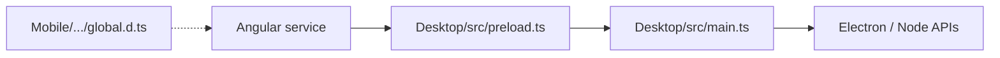

# Mobile + Desktop Template

A skeleton for a fully cross-platform application built on a single shared Angular + Ionic codebase targeting three platforms:

| Platform | Stack | Directory |
|----------|-------|-----------|
| **Web** | Angular + Ionic (browser) | `Mobile/` |
| **Mobile** | Angular + Ionic + Capacitor (Android / iOS) | `Mobile/` |
| **Desktop** | Electron (loads the Ionic web build) | `Desktop/` |

Platform-specific behaviour (e.g. notifications) is routed at runtime by `PlatformService`, which detects the current environment and delegates to the appropriate implementation. Shared facades such as `NotificationService` call either `ElectronNotificationService` or `MobileNotificationService` (Capacitor) depending on the platform.

This repository is an npm workspaces monorepo:

1. `Mobile/` — Angular + Ionic + Capacitor app (shared UI)
2. `Desktop/` — Electron shell that loads `Mobile/www`

---

## Prerequisites

- **Node.js** `^22.22.3` (or another LTS version supported by Angular 22)
- **npm** (workspaces enabled; comes with Node)
- For **Android** builds:
  - Android Studio
  - Android SDK
  - JDK 17+

A global Ionic CLI install is optional. Root npm scripts use the Angular CLI and Capacitor CLI from workspace dependencies.

---

## How to Use This Template

1. Clone or copy this repository.
2. From the **repo root**, install all workspace dependencies:

```bash
npm install
```

3. Customize the shared UI under `Mobile/src`.
4. Add platform-specific behaviour using the [Development](#development) patterns (Electron bridge + Capacitor + delegate services).
5. Before shipping, change the app id and name in [`Mobile/capacitor.config.ts`](Mobile/capacitor.config.ts) and the Android `applicationId` / package namespace under `Mobile/android`.

---

## Scripts Cheat Sheet

Run these from the **repo root**:

| Goal | Command |
|------|---------|
| Dev mobile (browser) | `npm run start:mobile` |
| Dev desktop | Build mobile for `file://`, then `npm run start:desktop` (see [Desktop](#desktop)) |
| Format | `npm run format:mobile` / `npm run format:desktop` |
| Build | `npm run build:mobile` / `npm run build:desktop` |
| Package | `npm run package:mobile` / `npm run package:desktop` |

What the package scripts do:

- **`package:mobile`** — runs `ng build && npx cap sync`. Syncs web assets into the native Capacitor project. It does **not** produce an APK by itself; open Android Studio (or Gradle) for that.
- **`package:desktop`** — runs Electron Forge package. Build the mobile web assets with `--base-href ./` first so Electron can load them via `file://`.

---

## Dev / Test

### Browser (fastest)

```bash
npm run start:mobile
```

Open [http://localhost:4200](http://localhost:4200) and use browser DevTools.

### Desktop

Electron loads `Mobile/www/index.html` via `file://`, so the web build needs a relative base href:

```bash
npm run build --workspace=Mobile -- --base-href ./
npm run start:desktop
```

Open Electron DevTools with `Ctrl+Shift+I` (Linux/Windows) or **View → Toggle Developer Tools**.

`start:desktop` compiles TypeScript (`Desktop/src` → `Desktop/dist`) then launches Electron.

#### Desktop troubleshooting (blank / black window)

1. Confirm [`Desktop/src/main.ts`](Desktop/src/main.ts) loads `../../Mobile/www/index.html` (relative to compiled `Desktop/dist`).
2. Confirm the mobile build used `--base-href ./`.
3. Confirm `npm run build:desktop` succeeded so `Desktop/dist/main.js` exists.

### Android (device or emulator)

```bash
npm run package:mobile
npx cap open android --workspace=Mobile
```

In Android Studio, pick a device/emulator and press **Run**. Debug with Logcat and Chrome remote debugging for the WebView (`chrome://inspect`).

If the `Mobile/android` folder is missing (first time only):

```bash
npm run build:mobile
npx cap add android --workspace=Mobile
npx cap sync android --workspace=Mobile
```

---

## Development

This section covers how to extend the template: Electron APIs, Capacitor for web/mobile, and cross-platform Angular services.

### Electron API bridge

Angular never talks to Node/Electron APIs directly. Interaction goes through the `window.electronApi` bridge:



To add a new Electron capability:

1. **Handle it in the main process** — [`Desktop/src/main.ts`](Desktop/src/main.ts)

```typescript
ipcMain.handle('desktop-do-something', async (_event, value: string) => {
  // Node.js / Electron APIs here
});
```

2. **Expose it on the preload bridge** — [`Desktop/src/preload.ts`](Desktop/src/preload.ts)

```typescript
contextBridge.exposeInMainWorld('electronApi', {
  showMessageBox: (options: MessageBoxOptions) =>
    ipcRenderer.invoke('desktop-show-message-box', options),
  // add new methods alongside existing ones:
  doSomething: (value: string) => ipcRenderer.invoke('desktop-do-something', value),
});
```

3. **Type it for Angular** — [`Mobile/src/app/interfaces/global.d.ts`](Mobile/src/app/interfaces/global.d.ts)

```typescript
export interface IElectronAPI {
  showMessageBox: (options: {
    type: string;
    title: string;
    message: string;
  }) => Promise<void>;
  doSomething: (value: string) => Promise<void>;
}
```

Without the `global.d.ts` entry, TypeScript will not know about the new method on `window.electronApi`. After changing Desktop sources, rebuild/restart Electron (`npm run start:desktop`) so `Desktop/dist` picks up the changes.

See `NotificationService` / `ElectronNotificationService` for a working example (`showMessageBox`).

### Capacitor (web and mobile)

Capacitor is the default path for **web** and **native mobile**. Use official Capacitor plugins (or web APIs) directly in the Capacitor/mobile service implementation — no preload bridge is required.

Example from this template: [`capacitorNotification.service.ts`](Mobile/src/app/services/NotificationService/capacitorNotification.service.ts) uses `@capacitor/dialog`.

```typescript
import { Dialog } from '@capacitor/dialog';

await Dialog.alert({ title, message, buttonTitle: 'OK' });
```

That same implementation covers browser and Android/iOS when the facade’s `default` branch runs (anything that is not Electron).

### Cross-platform services (delegate pattern)

Create a new folder under `Mobile/src/app/services/` with:

| File | Role |
|------|------|
| `myFeature.service.ts` | Shared facade — picks Electron vs Capacitor based on `PlatformService` |
| `electronMyFeature.service.ts` | Electron-specific code (`window.electronApi`) |
| `capacitorMyFeature.service.ts` | Web/mobile code (Capacitor plugins / web APIs) |

Reference layout (notifications):

```
Mobile/src/app/services/NotificationService/
  notification.service.ts              # facade
  electronNotification.service.ts      # Electron
  capacitorNotification.service.ts     # Capacitor / web
```

**1. Electron implementation**

```typescript
import { Injectable } from '@angular/core';

@Injectable({ providedIn: 'root' })
export class ElectronMyFeatureService {
  async doSomething(value: string): Promise<void> {
    if (!window.electronApi) {
      throw new Error('electronApi bridge is not available');
    }
    await window.electronApi.doSomething(value);
  }
}
```

**2. Capacitor / web implementation**

```typescript
import { Injectable } from '@angular/core';

@Injectable({ providedIn: 'root' })
export class CapacitorMyFeatureService {
  async doSomething(value: string): Promise<void> {
    // Capacitor plugin or browser API
  }
}
```

**3. Shared facade**

```typescript
import { Injectable } from '@angular/core';
import { PlatformService } from '../platform.service';
import { ElectronMyFeatureService } from './electronMyFeature.service';
import { CapacitorMyFeatureService } from './capacitorMyFeature.service';

@Injectable({ providedIn: 'root' })
export class MyFeatureService {
  constructor(
    private platformService: PlatformService,
    private electron: ElectronMyFeatureService,
    private capacitor: CapacitorMyFeatureService,
  ) {}

  async doSomething(value: string): Promise<void> {
    switch (this.platformService.getPlatform()) {
      case 'electron':
        await this.electron.doSomething(value);
        return;
      default:
        await this.capacitor.doSomething(value);
        return;
    }
  }
}
```

`getPlatform()` returns one of: `'electron'` | `'android'` | `'ios'` | `'capacitor'` | `'cordova'` | `'hybrid'` | `'web'` | `'unknown'`.

The `default` branch handles all Capacitor mobile and web targets.

**4. Use only the facade in components**

```typescript
constructor(private myFeature: MyFeatureService) {}

async handleAction(): Promise<void> {
  await this.myFeature.doSomething('hello');
}
```

Never inject the Electron or Capacitor implementations directly in components.

---

## Package Android APK

`package:mobile` prepares the native project. The APK is built in Android Studio (recommended) or with Gradle.

### Option 1: Android Studio (recommended)

```bash
npm run package:mobile
npx cap open android --workspace=Mobile
```

In Android Studio:

- **Debug APK:** Build → Build Bundle(s) / APK(s) → Build APK(s)
- **Play Store:** Build → Generate Signed Bundle / APK → Android App Bundle (or APK)

### Option 2: Gradle CLI

```bash
npm run package:mobile
cd Mobile/android
./gradlew assembleDebug
```

Release app bundle:

```bash
./gradlew bundleRelease
```

Output locations:

- Debug APK: `Mobile/android/app/build/outputs/apk/debug/`
- Release AAB: `Mobile/android/app/build/outputs/bundle/release/`

---

## Package Desktop App

1. Build mobile web assets for Electron:

```bash
npm run build --workspace=Mobile -- --base-href ./
```

2. Package with Electron Forge:

```bash
npm run package:desktop
```

3. Find packaged output under `Desktop/out` (or `Desktop/out/make`, depending on the Forge maker).

---

## Useful Paths

| Path | Purpose |
|------|---------|
| `Mobile/src` | Shared Angular + Ionic source |
| `Mobile/src/app/interfaces/global.d.ts` | TypeScript types for `window.electronApi` |
| `Mobile/www` | Web build output (Capacitor + Electron) |
| `Mobile/android` | Capacitor Android native project |
| `Desktop/src/main.ts` | Electron main process (IPC handlers) |
| `Desktop/src/preload.ts` | Electron preload / `electronApi` bridge |
| `Desktop/dist` | Compiled Electron output (`tsc`) |
